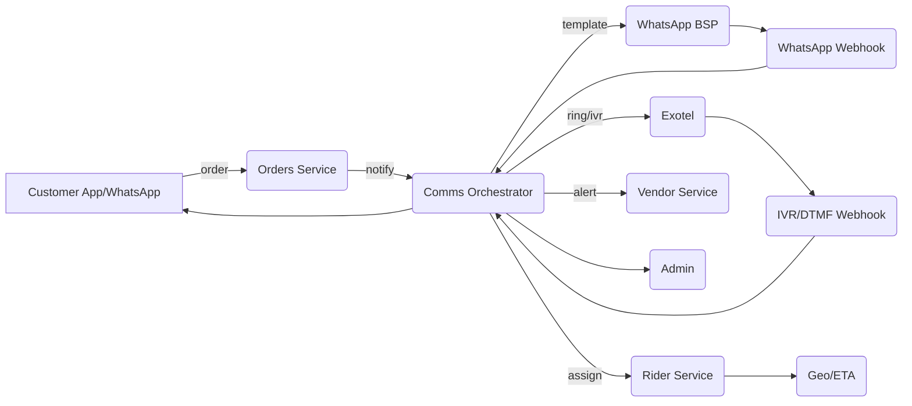

# Mangwale Ops & Communications Backend — Exotel + WhatsApp Orchestration
**Version:** 1.0  
**Owner:** Mangwale.ai Core Platform  
**Scope:** Vendor, Rider, Customer, Admin communications and ops flows powered by **Exotel (Ring/IVR/Bridge)** + **WhatsApp** with app fallbacks.  
**Target Runtime:** Node.js (NestJS), Postgres, Redis, Message Queue (Kafka/RabbitMQ/SQS), Exotel APIs, WhatsApp BSP (Cloud API or Partner).

---

## 0) Goals & Non-Goals
### Goals
- Zero-chase operations using **App → WhatsApp → Exotel Ring → IVR → Admin** escalation.
- Robust state machine for orders: `pending → partial → confirmed → processing → handover → out_for_delivery → delivered (→ cancelled/returned)`.
- Habit formation for Vendors/Riders using **Saved Exotel Numbers** (New Order / Reminder / Address Update).
- Mid-route **address change**, **special instructions**, **COD → UPI switch**, **bridge calls**.
- Idempotent, observable, and auditable flows with replays.

### Non-Goals
- Full marketplace/catalog/payments systems (integrated via APIs).
- On-device Rider/Vendor app logic (this file exposes backend endpoints the apps consume).

---

## 1) High-Level Architecture
- **NestJS services**: `orders`, `vendors`, `riders`, `comms`, `ivr`, `whatsapp`, `geo`, `analytics`, `admin`, `integrations`.
- **Postgres**: normalized order + comms schema (with JSONB storages for payloads).
- **Redis**: short-lived caches, distributed locks, SLA timers (TTL keys), rate limits.
- **Message Queue** (Kafka/Rabbit/SQS): event bus (`order.*`, `comms.*`, `ivr.*`, `wa.*`).
- **Exotel**: Outbound ring/IVR/bridge, inbound webhooks (DTMF, status).
- **WhatsApp**: Template sends, quick reply capture, inbound webhooks.
- **Geo**: ETA/distance, rider off-route detection (map provider).
- **Observability**: Prometheus metrics, Grafana dashboards, Loki logs, OTEL traces.
- **Feature Flags**: gradual rollouts per city/vendor tier.

Mermaid overview:


---

## 2) Core State Machine (Order Lifecycle)
States: `pending`, `partial`, `confirmed`, `processing`, `handover`, `out_for_delivery`, `delivered`, `cancelled`

**Transitions**
- `pending → partial` (wallet/top-up part-paid)
- `partial → confirmed` (balance received / COD approved)
- `confirmed → processing` (vendor accepted)
- `processing → handover` (vendor marked ready)
- `handover → out_for_delivery` (rider picked up)
- `out_for_delivery → delivered` (delivered & proof)
- `* → cancelled` (rules/edge cases)

Each transition emits events: `order.state.changed` with `from`, `to`, actor, timestamps.

**SLA timers**
- Vendor accept SLA (e.g., 2 min) → ring → ivr → admin.
- Processing reminder (2–3 min before ETA) → ring → optional IVR (mark ready / extend).
- Handover wait (rider reach vendor but not ready) → notify vendor + admin soft ping.
- OTD window for rider → off-route alert → ring/IVR with re-navigation.

---

## 3) Phone Number Strategy (Exotel)
- **Dedicated Outbound DID** per purpose; instruct vendors/riders to **save contacts**:
  - `+91-XXXXXXXXXX` **📦 New Order – Mangwale**
  - `+91-YYYYYYYYYY` **⏱ Order Reminder – Mangwale**
  - `+91-ZZZZZZZZZZ` **📍 Address Update – Mangwale**
- Optionally **pool numbers** per city and rotate via header routing.
- **Caller-ID Consistency**: same DID for the same purpose to build habit.

---

## 4) WhatsApp Templates (Examples)
> Use placeholders with double braces; register with BSP.

- **Vendor_New_Order**  
  `Hi {{1}}, new order #{{2}} of ₹{{3}}. Items: {{4}}. Payment: {{5}}. Quick actions:`  
  Buttons: `Accept`, `Reject`, `Set Prep 15`, `Set Prep 20`, `Set Prep 30`

- **Vendor_Ready_Reminder**  
  `Reminder: Order #{{1}} prep time ends in {{2}} min. Mark ready or extend 10m.`

- **Rider_Assignment**  
  `Pickup: {{1}} → Drop: {{2}}. Amount: {{3}}. Tap to accept.`

- **Rider_Address_Updated**  
  `⚠️ Address updated for order #{{1}}: {{2}}. Open map: {{3}}. Confirm received.`

- **Customer_Delay**  
  `Order #{{1}} will take {{2}} extra minutes. Thanks for your patience.`

---

## 5) IVR Scripts (Exotel)
- **Vendor New Order (no answer to WA/app)**  
  “You have a new Mangwale order of rupees {{amount}}. Press 1 to accept, 2 to reject, 3 to set preparation time.”  
  - If `3`: “Press 1 for 15 minutes, 2 for 20, 3 for 30.”

- **Processing Reminder (picked)**  
  “Reminder: Order {{order_id}} processing time is ending. Press 1 to mark ready, 2 to extend by 10 minutes.”

- **Rider Assignment (no answer to WA/app)**  
  “Pickup from {{vendor_name}} to {{drop_area}}, amount {{amount}}. Press 1 to accept, 2 to reject.”

- **Address Update (critical)**  
  “Important: Delivery address changed to {{new_address}}. Press 1 to confirm.”

- **Bridge Menu**  
  “Press 5 to connect to admin support.”

All IVR nodes must POST DTMF to backend webhook with `call_sid`, `digit`, `context` payload.

---

## 6) Services & Endpoints (NestJS-style)
> Prefix all routes with `/api/v1`. Secure via JWT (service-to-service) + user tokens (apps).

### 6.1 Orders Service
- `POST /orders` — create order (from checkout)
- `GET /orders/:id` — fetch order details
- `PATCH /orders/:id/state` — transition state (role-based)
- `POST /orders/:id/address` — change address (admin/customer support only)
- `POST /orders/:id/notes` — add internal ops note (voice/text)
- `GET /orders/:id/timeline` — state + comms timeline

**Events Emitted**:  
- `order.created`, `order.state.changed`, `order.address.changed`

### 6.2 Vendor Service
- `GET /vendors/:id` — profile, status
- `POST /vendors/:id/activate` — re-activate via IVR/ops
- `POST /vendors/:id/deactivate` — auto after repeated misses
- `POST /vendors/:id/ack` — ack new order (accept/reject + prep time)
- `POST /vendors/:id/ready` — mark ready (handover)
- `GET /vendors/:id/metrics` — fulfilment, misses, SLAs

### 6.3 Rider Service
- `GET /riders/:id` — profile, shift, capacity
- `POST /riders/:id/assign` — assign order (dispatch)
- `POST /riders/:id/ack` — accept/reject assignment
- `POST /riders/:id/route` — update route/waypoints (after address change)
- `POST /riders/:id/exception` — can’t find customer / safety / COD issue
- `GET /riders/:id/metrics` — OTD, acceptance, earnings

### 6.4 Comms Orchestrator
- `POST /comms/notify/vendor/order` — WA + Ring + IVR escalation kickoff
- `POST /comms/notify/vendor/reminder` — processing time reminder
- `POST /comms/notify/rider/assign` — WA + Ring + IVR for assignment
- `POST /comms/notify/rider/address-update` — WA + Ring + IVR
- `POST /comms/bridge` — initiate Exotel bridge (rider↔vendor↔customer)
- `GET /comms/timeline/:orderId` — unified comms log

### 6.5 Webhooks (Public)
- `POST /webhooks/exotel/call-status` — ringing, answered, completed
- `POST /webhooks/exotel/dtmf` — digit pressed with `context`
- `POST /webhooks/whatsapp/inbound` — user replies, quick actions
- `POST /webhooks/whatsapp/status` — delivery/read receipts

Validate signatures; respond 200 idempotently.

### 6.6 Geo/ETA Service (Integrations)
- `POST /geo/eta` — ETA for pickup/drop (vendor→customer)
- `POST /geo/offroute-check` — rider polyline vs target deviation
- `POST /geo/reverse-geocode` — for address confirmation texts

### 6.7 Analytics/Reports
- `GET /analytics/vendors` — acceptance %, avg prep time, misses
- `GET /analytics/riders` — acceptance %, OTD, off-route rate
- `GET /analytics/orders` — SLA breaches, comms escalations
- `GET /analytics/comms` — WA vs IVR effectiveness

---

## 7) Event Contracts (MQ Topics)
All events share headers: `event_id`, `occurred_at`, `actor`, `city`, `trace_id`.

- **order.created**  
  ```json
  {
    "order_id": "MW-2025-000123",
    "user_id": "U-123",
    "vendor_id": "V-42",
    "amount": 325,
    "payment": {"mode":"prepaid","status":"success"},
    "items": [{"sku":"FOOD-POHA","qty":1}],
    "delivery": {"address_id":"A-88","lat":19.99,"lng":73.78}
  }
  ```

- **order.state.changed**  
  ```json
  { "order_id":"MW-2025-000123","from":"confirmed","to":"processing","by":"vendor:V-42" }
  ```

- **order.address.changed**  
  ```json
  {
    "order_id":"MW-2025-000123",
    "old":{"lat":19.98,"lng":73.77,"text":"Shivaji Nagar"},
    "new":{"lat":20.01,"lng":73.79,"text":"Shani Nagar, House 12"},
    "reason":"customer_request",
    "updated_by":"admin:A-11"
  }
  ```

- **comms.outbound.requested**  
  ```json
  {
    "channel":"whatsapp|exotel_ring|exotel_ivr",
    "template":"Vendor_New_Order",
    "to":"+91xxxxxxxxxx",
    "order_id":"MW-2025-000123",
    "payload":{"amount":325,"items":"Poha x1","payment":"prepaid"}
  }
  ```

- **comms.inbound.action** (DTMF/WA reply)  
  ```json
  { "order_id":"MW-2025-000123","actor":"vendor:V-42","action":"accept","meta":{"prep_min":20} }
  ```

---

## 8) Database Schema (Postgres, minimal)

```sql
-- Orders
create table orders (
  id text primary key,
  user_id text not null,
  vendor_id text not null,
  rider_id text,
  amount numeric(10,2) not null,
  payment_mode text check (payment_mode in ('prepaid','cod')),
  payment_status text check (payment_status in ('pending','partial','success','failed')),
  state text check (state in ('pending','partial','confirmed','processing','handover','out_for_delivery','delivered','cancelled')),
  prep_eta_minutes int,
  created_at timestamptz default now(),
  updated_at timestamptz default now()
);

-- Addresses
create table order_addresses (
  order_id text references orders(id) on delete cascade,
  type text check (type in ('drop','pickup')),
  address_text text,
  lat double precision,
  lng double precision,
  active boolean default true,
  created_at timestamptz default now()
);

-- Comms Log
create table comms_log (
  id bigserial primary key,
  order_id text,
  actor text, -- vendor:V-42 | rider:R-11 | user:U-123 | system
  channel text, -- whatsapp|exotel_ring|exotel_ivr|bridge
  direction text check (direction in ('outbound','inbound')),
  template text,
  payload jsonb,
  status text, -- sent|delivered|read|answered|completed|failed
  correlation_id text, -- wa msg id / exotel call sid
  created_at timestamptz default now()
);

-- Vendors / Riders minimal
create table vendors ( id text primary key, name text, phone text, active boolean default true, city text );
create table riders  ( id text primary key, name text, phone text, active boolean default true, city text );

-- SLA Timers
create table sla_timer (
  id bigserial primary key,
  order_id text,
  type text, -- vendor_accept, processing_reminder, rider_ack, address_confirm
  due_at timestamptz,
  fired boolean default false,
  meta jsonb
);
```

---

## 9) Orchestrations (Queues + Cron/Timers)

### 9.1 Vendor Accept Escalation
- On `order.state.changed: confirmed`:
  1. Send WA template → log.
  2. Set SLA timer T+2m → `vendor_accept`.
  3. If no `vendor.accept` by T+2m:
     - Trigger Exotel **ring** from “📦 New Order – Mangwale” DID.
     - Set timer T+1m → if still no response, trigger **IVR**.
  4. If still no action by T+4m:
     - Raise `ops.exception` → admin dashboard card.
     - Optionally auto-deactivate vendor after N misses.

### 9.2 Processing Reminder
- On vendor sets `prep_eta_minutes`:
  - Create SLA at `prep_end - 3m` → **ring reminder**.
  - If answered → IVR (ready/extend); else just log “ring only”.
  - If extend → notify customer WA; shift next reminder accordingly.

### 9.3 Rider Assignment & Address Change
- On `handover` → assign rider, WA + ring; escalate to IVR at T+2m.
- On `order.address.changed`:
  - WA + deep link map; **ring** immediately.
  - If no confirm within 2m → **IVR confirm**; if rejected → admin bridge.

### 9.4 Exceptions & Bridges
- Any `rider.exception` or repeated vendor miss:
  - Provide one-click `/comms/bridge` to connect rider↔vendor↔customer via Exotel.

---

## 10) External Dependencies & Required Endpoints (Other Systems)
- **Catalog**: `GET /catalog/items?vendor_id=...`
- **Payments**: webhook to update `payment_status` and move `pending/partial → confirmed`
- **User Profiles**: `GET /users/:id` (name, language, prefs)
- **Vendor Hours**: `GET /vendors/:id/hours` (open/close)
- **Rider Dispatch/Capacity**: `GET /riders/available?area=...` + `POST /riders/:id/assign`
- **Geo Provider**: Directions/ETA APIs for:

  ```json
  { "from": {"lat":..., "lng":...}, "to": {"lat":..., "lng":...} }
  ```

- **Auth**: OAuth/JWT for apps + service accounts for webhooks.

---

## 11) Security, Idempotency, Resilience
- **JWT** for internal services; rotate keys. Signature checks on all webhooks.
- **Idempotency-Key** header on mutating endpoints (orders/comms).
- **At-least-once** delivery on events; consumers must be **idempotent**.
- **Retry with backoff** for BSP/Exotel failures; circuit breaker; dead-letter queue.
- **PII minimization** in logs; encrypt phone numbers at rest; access control by role & city.
- **Rate limits** per vendor/rider to prevent spam.

---

## 12) Observability & Ops
- **Metrics** (Prometheus):
  - `vendor_accept_sla_breaches_total`
  - `processing_reminder_calls_total`
  - `ivr_actions_total{action="accept|reject|extend"}`
  - `wa_send_total{template="..."} / wa_fail_total`
  - `ring_to_action_latency_seconds`
  - `offroute_alerts_total`
- **Dashboards**:
  - Comms Funnel (WA→Ring→IVR→Admin).
  - Vendor Reliability Heatmap.
  - Rider OTD & Off-route.
- **Audit/Replay**: reconstruct per-order comms from `comms_log` + events.
- **Runbooks**: what to do when Exotel/WA/BSP down → feature flags to degrade gracefully (app-only).

---

## 13) Seed WhatsApp & IVR Actions → Backend Mappings
- WA Button **Accept** → `POST /vendors/:id/ack { order_id, action:"accept", prep_min }`
- WA Button **Reject** → `POST /vendors/:id/ack { order_id, action:"reject", reason }`
- IVR Digit **1** (Vendor accept) → same as above with `source:"ivr"`
- IVR Digit **2** (Vendor reject) → `reject`
- IVR Digit **3** (Set prep) → follow-up DTMF → update `prep_eta_minutes`
- IVR Digit **1** (Processing reminder) → `POST /vendors/:id/ready { order_id }`
- IVR Digit **2** (Extend) → `PATCH /orders/:id/state { to:"processing", meta:{ extend_min:10 } }`
- Rider IVR **1** (accept) / **2** (reject) → `POST /riders/:id/ack`
- Rider IVR **5** (bridge to admin) → `/comms/bridge`

All inbound map to **single command handler** that validates state machine constraints (e.g., cannot mark ready before processing).

---

## 14) Environment & Config
```env
# Exotel
EXOTEL_ACCOUNT_SID=
EXOTEL_API_KEY=
EXOTEL_API_TOKEN=
EXOTEL_DID_NEW_ORDER=+91XXXXXXXXXX
EXOTEL_DID_REMINDER=+91YYYYYYYYYY
EXOTEL_DID_ADDRESS=+91ZZZZZZZZZZ
EXOTEL_WEBHOOK_SECRET=...

# WhatsApp BSP
WA_API_URL=
WA_TOKEN=
WA_TEMPLATE_NAMESPACE=...
WA_WEBHOOK_SECRET=...

# Core
POSTGRES_URL=
REDIS_URL=
MQ_BROKER_URL=
JWT_INTERNAL_SECRET=
FEATURE_FLAGS=city.nashik.exotel=true,wa=true
```

---

## 15) Error Model & Common Codes
- `409_CONFLICT`: invalid state transition
- `422_UNPROCESSABLE_ENTITY`: missing IVR digit/WA payload
- `429_TOO_MANY_REQUESTS`: rate limited
- `499_CLIENT_CANCELLED`: user hung up before DTMF
- `502_UPSTREAM_BSP`: WhatsApp provider failure
- `503_EXOTEL_DOWN`: temporary outage (trigger feature flag fallback)

---

## 16) Acceptance Criteria (E2E)
- If vendor ignores WA, **ring** within 2m; if no action, **IVR** within 3m; else **admin** within 5m.
- Processing reminder triggers **ring** 3m before ETA; IVR if answered.
- Address change triggers rider **WA + ring**, IVR if no confirm in 2m.
- All actions are **idempotent**, logged, and visible in comms timeline.
- Metrics dashboards show funnel and SLA breaches by city/vendor tier.

---

## 17) Appendix: Sample Payloads

**/comms/notify/vendor/order (request)**
```json
{
  "order_id":"MW-2025-000123",
  "vendor_id":"V-42",
  "phone":"+91xxxxxxxxxx",
  "amount":325,
  "items":"Poha x1",
  "payment":"prepaid",
  "city":"Nashik",
  "language":"hi"
}
```

**/webhooks/exotel/dtmf (inbound)**
```json
{
  "call_sid":"EXO-abc123",
  "to":"+91xxxxxxxxxx",
  "from":"+91zzzzzzzzzz",
  "context":"vendor_new_order",
  "order_id":"MW-2025-000123",
  "vendor_id":"V-42",
  "digit":"1",
  "ts":"2025-09-16T06:10:00Z",
  "signature":"..."
}
```

**/webhooks/whatsapp/inbound (quick reply)**
```json
{
  "msg_id":"wamid.HBgM...",
  "phone":"+91xxxxxxxxxx",
  "template":"Vendor_New_Order",
  "button":"Accept",
  "order_id":"MW-2025-000123",
  "vendor_id":"V-42"
}
```

---

## 18) Suggested NestJS Module Layout
```
apps/api/src/
  modules/
    orders/
    vendors/
    riders/
    comms/
      whatsapp/
      exotel/
      orchestrator.service.ts
    geo/
    admin/
    analytics/
    webhooks/
      exotel.controller.ts
      whatsapp.controller.ts
  libs/
    database/
    mq/
    auth/
    observability/
```

---

**This spec is designed to hand directly to your VS Code Copilot / dev team to scaffold controllers, services, DTOs, and workers.**  
Roll out city-by-city with feature flags; start with WA + Ring, then add IVR & Bridge. Good luck 🚀
